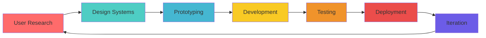

# 👋 Hello, I'm Stephen Mburu

<div align="center">

```typescript
interface UIUXMaster {
  name: string;
  location: string;
  passion: string[];
  expertise: {
    frontend: string[];
    design: string[];
    architecture: string[];
    tools: string[];
  };
  currentMission: string;
  superpower: string;
  workStyle: string;
  coffeeLevel: number; // ☕ units per day
}

const stephen: UIUXMaster = {
  name: "Stephen Mburu",
  location: "Nairobi, Kenya 🇰🇪",
  passion: [
    "Pixel Perfect UI ✨", 
    "Seamless UX 🎯", 
    "Design Systems 🏗️",
    "Open Source 💖"
  ],
  expertise: {
    frontend: ["React", "Angular", "TypeScript", "Next.js", "Vue.js"],
    design: ["Figma", "Adobe XD", "Prototyping", "User Research", "Wireframing"],
    architecture: ["Component Libraries", "State Management", "Performance Optimization"],
    tools: ["Git", "Docker", "AWS", "Vercel", "Storybook"]
  },
  currentMission: "Building KenyaTech - The Ultimate Developer Platform 🚀",
  superpower: "Turning coffee into beautiful, functional interfaces ☕→🎨",
  workStyle: "Design First, Code Smart, Ship Fast 🚀",
  coffeeLevel: 9000 // It's over 9000!
};
```

</div>

## 🚀 What I'm Building

<table>
<tr>
<td width="50%">

### 🔥 Current Focus
- **KenyaTech Platform** - Empowering local developers
- **Design System Library** - Scalable UI components
- **Open Source Tools** - Community-driven projects

</td>
<td width="50%">

### 🎯 Mission
Creating digital experiences that don't just work—they **inspire**. Bridging the gap between stunning design and flawless functionality, one pixel at a time.

</td>
</tr>
</table>

## 🛠️ Tech Arsenal

<div align="center">

### Frontend Magic ✨


### Design Craft 🎨


### Cloud & DevOps ☁️


</div>

## 📊 GitHub Analytics

<div align="center">


</div>

<div align="center">

</div>

## 🎯 Design Philosophy

> **"Great design is invisible. Great code is readable. Great products are both."**



## 🌟 Featured Projects

<div align="center">

| Project | Description | Tech Stack | Status |
|---------|-------------|------------|--------|
| 🚀 **KenyaTech Platform** | Ultimate developer platform for Kenya | React, TypeScript, AWS | 🔥 Active |
| 🎨 **UI Component Library** | Reusable design system components | React, Storybook, CSS-in-JS | ✅ Stable |
| 📱 **Mobile Design Kit** | Cross-platform design patterns | Figma, React Native | 🚧 In Progress |
| 🛠️ **Dev Tools Suite** | Productivity tools for developers | Node.js, Electron | 💡 Planning |

</div>

## 🎨 Design Showcase

<details>
<summary>🖼️ View My Design Work</summary>

### UI/UX Portfolio Highlights
- **Mobile Banking App** - Simplified financial transactions for rural Kenya
- **E-commerce Platform** - Modern shopping experience with local payment integration  
- **Developer Dashboard** - Analytics and project management for tech teams
- **Educational App** - Interactive learning platform for coding bootcamps

*More designs available on [Dribbble](https://dribbble.com) & [Behance](https://behance.net)*

</details>

## 🤝 Let's Connect & Collaborate

<div align="center">

[](https://linkedin.com/in/stephen-mburu)
[](https://twitter.com/stephen_mburu)
[](https://dribbble.com/stephen-mburu)
[](mailto:stephen@example.com)

</div>

## ☕ Fun Facts

<table>
<tr>
<td>

- 🌅 **Early Bird**: Best code written between 5-8 AM
- ☕ **Coffee Enthusiast**: 6+ cups fuel my creativity
- 🎵 **Music Lover**: Lo-fi beats while coding
- 🏃‍♂️ **Weekend Runner**: Debug life, one kilometer at a time

</td>
<td>

```javascript
const stephenStats = {
  linesOfCode: 500000+,
  coffeeCups: Infinity,
  projectsShipped: 50+,
  hoursOfDesign: "Too many to count",
  favoriteEmoji: "🚀"
};
```

</td>
</tr>
</table>

---

<div align="center">

### 💫 *"Crafting digital experiences that matter, one commit at a time"*


**⭐ Star my repos if you find them useful!**

</div>
